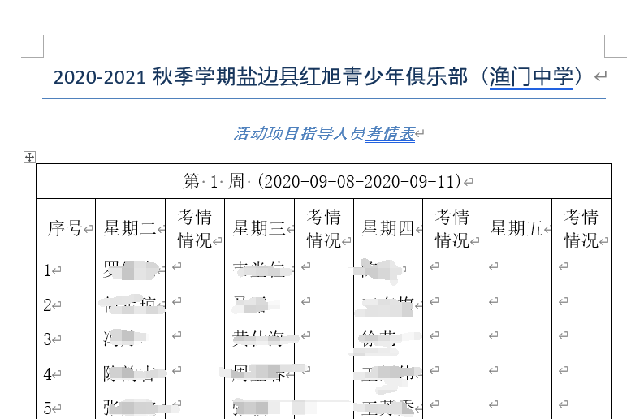

# Introduction
It is a tedious work to distribute a set of job for teachers that some have personal constraint if you done it by hand, usually it cost one or two week to finish it and it may cause some problems. However, by exploiting Python to properly design a small program that help much!

In this script, it reads the teachers' information from a spreadsheet and according to their needs to quickly generate a whole set of distribution and write to a spreadsheet and a word document by each week in different grade simultaneously.

# Output example

Excel spreadsheet like this

Word documents like this

## How to use it
- You need install python3 for it run correctly
  if you do not have install python3 you can download it from its official website to download it for free

- After install python3 you need to install required dependences by using:

  pip install -r requirements.txt`

- When all set, you just run it by typing the following script in your terminal window:

  python3 distribution_system.py`
